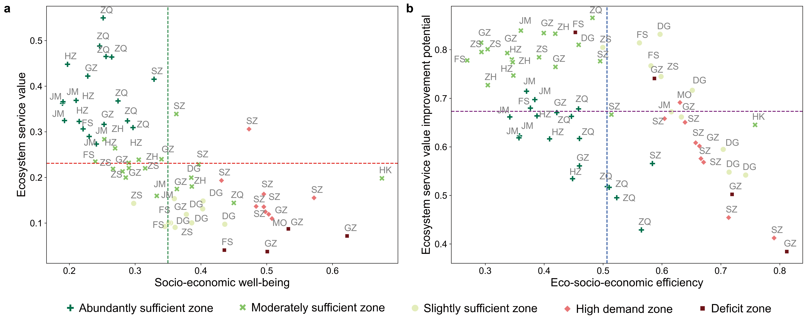

# 🌍 Spatial eco-socio-economic trade-offs inform differentiated management strategies in mega-urban agglomerations

This repository contains the official implementation of the paper:

> **"Spatial eco-socio-economic trade-offs inform differentiated management strategies in mega-urban agglomerations"**
>
> Published in *npj Urban Sustainability*, 2025
>
> 🔗 [Read the paper](https://www.nature.com/articles/s42949-025-00231-x)

---


## Project overview

- Developed a framework using production possibility frontiers (PPF) to evaluate eco-socio-economic efficiency and ecosystem service value improvement potential in mega-urban agglomerations.

- Employed the InVEST model to map ecosystem service supply and integrated high-resolution location-based data to measure ecosystem service demand in the Guangdong-Hong Kong-Macao Greater Bay Area (GBA).
- Conducted k-means clustering and fitted production possibility frontiers to assess trade-offs between ecosystem service value and socio-economic well-being across distinct zones within the GBA.
- Provided tailored recommendations for eco-economic coordination, ecological restoration, and payment for ecosystem services policies, supporting balanced growth and environmental sustainability.


## Datasets

This study utilized diverse datasets to quantify the spatial relationships between ESV and socio-economic well-being in the GBA. For ESV estimation, land use data (2021) were obtained from Land Cover Explorer (https://livingatlas.arcgis.com/landcoverexplorer/). Road network data (2021) were acquired from OpenStreetMap (https://www.openstreetmap.org/), and line density of different roads was calculated using ArcGIS Pro 2.5.2. As land surface temperature data (2021) were unavailable, daytime and nighttime land surface temperature data (2020) were used, sourced from RESDC (https://www.resdc.cn/DOI/DOI.aspx?DOIID=98). Soil type data were also obtained from RESDC (https://www.resdc.cn/data.aspx?DATAID=145). Precipitation data were retrieved from GeoData (https://www.geodata.cn/main/index.html#/face_science_detail?typeName=face_science&guid=113786088533256).


## Method summary

### Ecosystem service and socio-economic indicators

We selected four key ecosystem services important for urban resilience and planning:

- Carbon storage and sequestration
- Habitat quality
- Urban cooling
- Urban flood risk mitigation

These were used to calculate an ecosystem service value (ESV) as a proxy for ecological supply.

### Spatial classification and clustering

We characterized spatial heterogeneity by computing:

- Ecosystem service supply–demand ratios (ESSDR)
- Normalized socio-economic indicators

Using these metrics, the study applied k-means clustering to classify county-level units into **five eco-socio-economic zone types**, with the optimal cluster number validated via elbow and silhouette methods. 

### Trade-off analysis with production possibility frontier

For each zone, we fitted zone-specific PPF curves, **modeling the trade-off between ESV and socio-economic well-being**. The PPF exposes how increasing socio-economic outputs are associated with reductions in ecological value and identifies thresholds where trade-offs accelerate.


### Efficiency and improvement metrics

- **Eco-socio-economic efficiency**: distance of each unit from its PPF, representing current performance relative to theoretical maxima. 

- **ESV improvement potential**: the potential ecological gains if socio-economic well-being were held constant at optimal levels.

These metrics allow identification of areas with high improvement opportunities or ecological deficits, informing differentiated management and planning strategies.




### Cite this article
If you find this repository useful, please cite our work:

🔹 BibTeX
```bibtex
@article{xu2025spatial,
  title={Spatial eco-socio-economic trade-offs inform differentiated management strategies in mega-urban agglomerations},
  author={Xu, Yuhan and Chen, Chen and Deng, Weipeng and Dai, Linlin and Yang, Tianren},
  journal={npj Urban Sustainability},
  volume={5},
  number={1},
  pages={43},
  year={2025},
  publisher={Nature Publishing Group UK London}
}
```
🔹 APA

Xu, Y., Chen, C., Deng, W., Dai, L., & Yang, T. (2025). Spatial eco-socio-economic trade-offs inform differentiated management strategies in mega-urban agglomerations. npj Urban Sustainability, 5(1), 43.

### Contact

For questions, feedback, or collaborations, please contact:

Yuhan Xu: [yxu899@gatech.edu]
